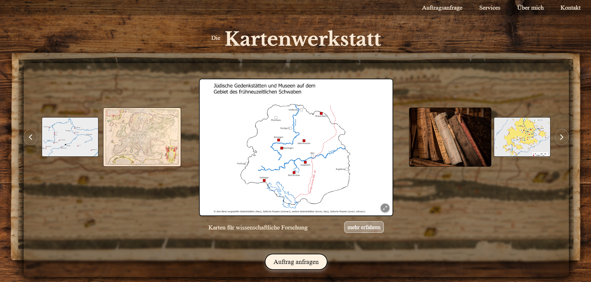
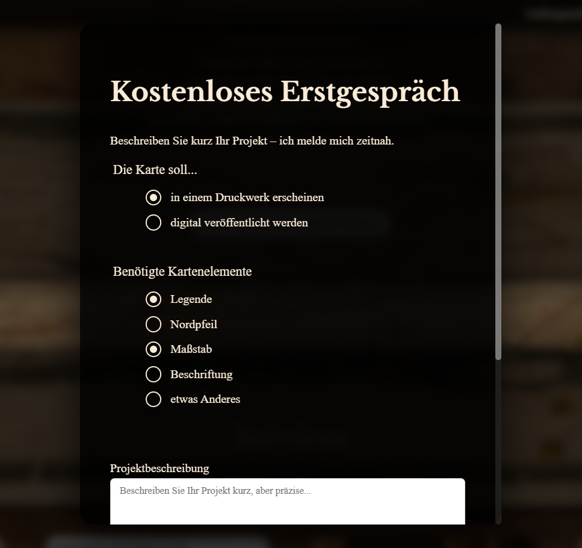

# Die Kartenwerkstatt

A service website for custom-made maps.

The website presents examples of my cartographic work and is designed to give potential clients an overview of the types of maps I can create. Visitors can browse selected map examples and learn more about the possibility of commissioning individual maps.

What I like most about this project ist that it combines my experience in cartography and QGIS with practical web development using HTML, CSS and Vanilla JavaScript.

## Preview

### Detail view

## Project status

This project is currently under active development.

The core website structure and map presentation are already implemented, while additional features, content and design refinements are still being added.

## Purpose

I created this website to present my cartographic work in a clear and visually appealing way in order to provide potential clients with an impression of my services.

Its main goals are:

- showcasing selected map projects
- presenting different types of cartographic work
- communicating my cartographic services to potential clients
- creating a professional online presence and providing an intuitive way for interested clients to order custom maps

## Features

- Presentation of map examples in an automatic but navigable carousel
- Large clickable main map view with neighbouring previews
- Previous / next navigation
- Zoom functionality of the clicked map example with fullscreen map view
- Responsive layout of the entire Kartenwerkstatt website including all its subsites
- Dynamic updates of displayed content within the carousel
- User-oriented presentation of map examples

## Technologies

- HTML5
- CSS3
- JavaScript
- DOM Manipulation
- Event Handling
- Responsive Web Design
- Vanilla JavaScript
- QGIS for the creation of the presented maps

## Technical concepts

The website uses JavaScript to manage the currently displayed map and update the surrounding interface dynamically.

The project gave me practical experience with:

- handling UI state
- dynamically updating visual content
- reacting to user interactions
- navigating through a collection of portfolio items
- DOM manipulation
- responsive interface design
- combining web development with externally created cartographic content

## Project context

"Die Kartenwerkstatt" combines two areas of my practical experience: cartography and web development.

The maps presented on the website are created using QGIS, while the website itself provides a custom-built interface for showcasing this work to potential clients.

The project therefore serves both as a technical web development project and as a practical portfolio for commissioned cartographic work.
